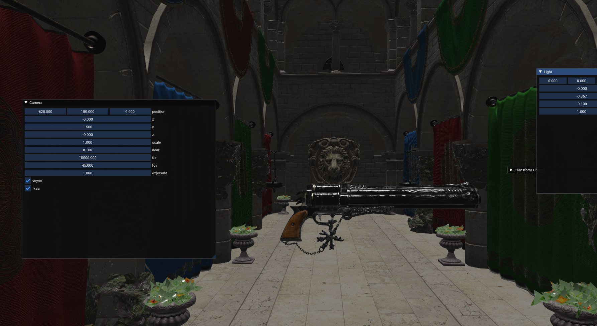
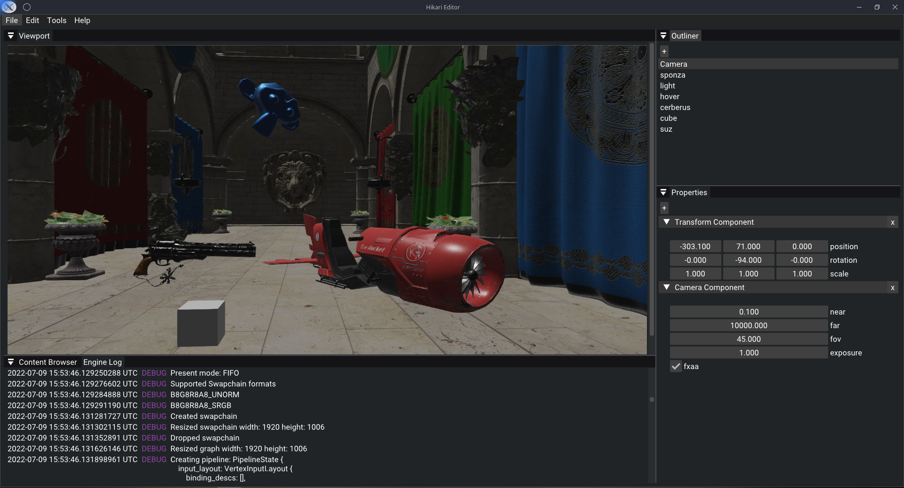

# Hikari
[](https://github.com/Ax9D/Hikari/actions/workflows/ci.yml)

Hikari is my personal Game Engine that I'm writing in my free time. 
The code is messy and a bit broken in some places.




## Vision
To write a easy to use, modular and performant Game Engine in Rust, and also learn more about writing Game Engines in the process.

### Features
* ECS Architecture
* Powerful Render Graph API powered by Vulkan
* Physically Based Rendering (a bit barebones atm)
* WYSIWYG Editor for loading and editing Scenes (WIP)

### Current Goals
- [X] Add minimal CI 
- [X] Implement an Asset Management System
- [X] Properly integrate the renderer into the Engine (and Editor)
- [ ] Add IBL support to the PBR Renderer
- [ ] Shadows
- [ ] Add scripting functionality (hikari_py)
- [ ] Animation System

## Build
To build Hikari, you'll need to have Rust installed, along with the VulkanSDK.

To build everything in the workspace, run:
```rust
cargo build --release --all
```

# Project Structure

Hikari is divided into a number of smaller crates found inside inside the `crates` folder. All of the functionality in these crates is reexported by the main `hikari` crate.


Low Level rendering functionality along with the render graph is provided by the `hikari_render` crate.

You can try running the pbr demo from this crate's root:

```rust
cargo run --release --example pbr
```

There are also two additional crates `hikari_editor` and `hikari_cli`, which are for the editor and cli interface (which are mostly stubs atm)

You can run the editor from the project root: 
```rust
cargo run -p hikari_editor
```

**The `testing` branch has an updated version the editor as seen in the screenshot above.**

## Thanks
Here is a list of projects that I'd like to thank which have heavily inspired the development of Hikari:

* [Hazel](https://github.com/TheCherno/Hazel) - Hazel Engine
* [Bevy](https://github.com/bevyengine/bevy) - A refreshingly simple data-driven game engine built in Rust
* [kajiya](https://github.com/EmbarkStudios/kajiya) - Experimental real-time global illumination renderer
* [Granite](https://github.com/Themaister/Granite)
* [Godot](https://github.com/godotengine/godot) - Multi-platform 2D and 3D game engine
* [egui-gizmo](https://github.com/urholaukkarinen/egui-gizmo) - 3d transformation gizmo built on top of the egui library